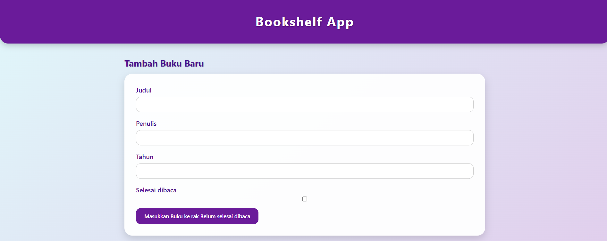
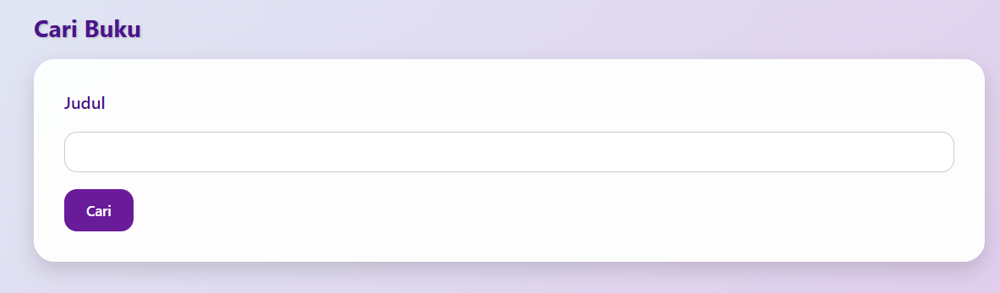
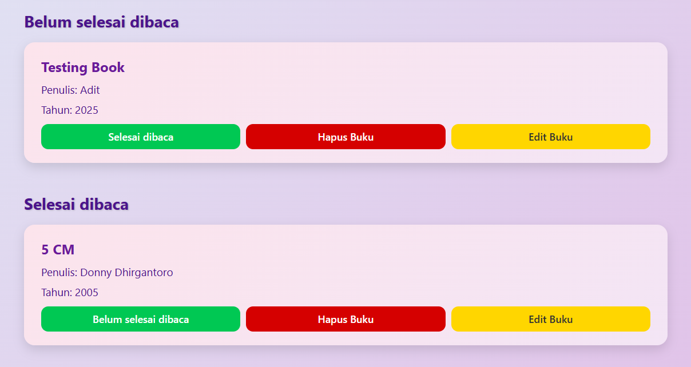

# 📚 Bookshelf App

**Bookshelf App** adalah proyek akhir dari kelas **Belajar Membuat Front-End Web untuk Pemula** di [Dicoding Indonesia](https://www.dicoding.com/).  
Aplikasi ini memungkinkan pengguna untuk **menambah, mengedit, mencari, menghapus, dan memindahkan buku** antara dua rak — **Belum Selesai Dibaca** dan **Selesai Dibaca**.  
Semua data tersimpan secara **persisten** menggunakan `localStorage`.

---

## 🚀 Fitur Utama

### 1. Tambah Buku Baru
Masukkan judul, penulis, tahun, dan centang jika buku sudah selesai dibaca.  
Data akan langsung tampil di rak sesuai statusnya.

📸 **Tampilan Fitur Tambah Buku**


---

### 2. Cari Buku
Masukkan judul buku di kolom pencarian untuk menemukan buku dengan cepat.

📸 **Tampilan Fitur Cari Buku**


---

### 3. Pindah Rak Buku
Ubah status buku dari *Belum Selesai Dibaca* menjadi *Selesai Dibaca*, atau sebaliknya hanya dengan satu klik tombol.

📸 **Tampilan Rak Buku**



---

## 🧱 Struktur Data Buku

Semua buku disimpan dengan struktur data berikut:

```js
{
  id: number,
  title: string,
  author: string,
  year: number,
  isComplete: boolean
}
